# MicroInvent: Sistema de Inventario Distribuido & PWA

  

## 📑 Índice

- [Descripción del Proyecto](#-descripción-del-proyecto)
- [Tecnologías Utilizadas](#-tecnologías-utilizadas)
- [Responsabilidades por Módulo](#-responsabilidades-por-módulo)
- [Instalación y Configuración Local](#-instalación-y-configuración-local)
  - [Opción 1: Con Docker (Recomendado)](#opción-1-con-docker-recomendado)
  - [Opción 2: Instalación Manual](#opción-2-instalación-manual)
- [Guía de Usuario](#-guía-de-usuario)
  - [Roles y Permisos](#roles-y-permisos)
  - [Funcionalidades por Rol](#funcionalidades-por-rol)
- [Arquitectura de Base de Datos](#-arquitectura-de-base-de-datos)
- [Despliegue en AWS](#-despliegue-en-aws)
- [Credenciales de Prueba](#-credenciales-de-prueba)

---

## 📖 Descripción del Proyecto

MicroInvent es una Aplicación Web Progresiva (PWA) diseñada para gestionar inventarios en tiempo real para negocios con múltiples sucursales. El sistema resuelve problemas de inconsistencia de stock mediante una arquitectura **Offline-First**, sincronización automática y manejo de concurrencia distribuida.

El proyecto está diseñado para ser desplegado en **AWS** utilizando servicios gestionados para garantizar escalabilidad y alta disponibilidad.

---

## 🛠 Tecnologías Utilizadas

La arquitectura ha sido seleccionada para cumplir con los requisitos de alto rendimiento, funcionamiento sin conexión y actualizaciones en tiempo real.

### Frontend (PWA Offline-First)

- **Core:** React.js 18+ con Vite
- **Routing:** React Router DOM v6
- **Estado & Sync:** TanStack Query (React Query) para gestión de estado asíncrono y caché
- **Base de Datos Local:** Dexie.js (Wrapper para IndexedDB) para almacenamiento offline
- **Estilos:** TailwindCSS para diseño responsive
- **Iconos:** Lucide React
- **Formularios:** Manejo nativo con validación
- **PWA:** Service Workers para funcionalidad offline

### Backend (API RESTful)

- **Runtime:** Node.js v18+
- **Framework:** Express.js
- **Autenticación:** JWT (jsonwebtoken) + bcryptjs para hashing
- **Base de Datos:** PostgreSQL 14+
- **ORM/Query:** pg (node-postgres) - Queries directos
- **Validación:** Validaciones manuales y middleware personalizado
- **CORS:** cors para comunicación cross-origin
- **Variables de Entorno:** dotenv

### Base de Datos

- **Motor:** PostgreSQL 14+
- **Características:**
  - Transacciones ACID
  - Índices para optimización de consultas
  - Constraints para integridad referencial
  - Triggers para auditoría (futuro)

### DevOps & Infraestructura

- **Containerización:** Docker + Docker Compose
- **Control de Versiones:** Git + GitHub
- **Despliegue (Planeado):** AWS (Amplify + Elastic Beanstalk + RDS)

---

## 👥 Responsabilidades por Módulo

El desarrollo se divide por dominios funcionales para mantener la independencia del código y facilitar la colaboración.

| Desarrollador | Módulo / Funcionalidad | Descripción Técnica |
|:---|:---|:---|
| **Jorge** | **Autenticación y Autorización** | Implementación de JWT, Middleware de protección de rutas, Sistema de roles (SuperAdmin/Admin/Employee), Gestión de sesiones por sucursal |
| **Jorge** | **Gestión de Sucursales** | CRUD de sucursales, Asignación de usuarios a sucursales, Control de acceso por sucursal |
| **Jorge** | **Inventario por Sucursal** | CRUD de productos, Visualización de stock en tiempo real, Manejo de alertas de stock bajo, Filtrado por sucursal |
| **Jorge** | **Gestión de Usuarios** | CRUD de usuarios, Asignación de roles, Restricciones por sucursal para admins |
| **Jorge** | **Configuración del Sistema** | Panel de configuración exclusivo para SuperAdmin, Reseteo de sistema, Eliminación de sucursales |
| **Jorge** | **Modo Offline & Sincronización** | Implementación de cola de sincronización, Manejo de conflictos, IndexedDB para almacenamiento local, Service Workers |
| **Jorge** | **Reportes y Análisis** | Generación de reportes de movimientos, Análisis de stock, Exportación de datos |
| **Jorge** | **Dashboard y Métricas** | Visualización de KPIs, Gráficos de inventario, Productos con stock bajo |
| **Angel** | **Transferencias entre Sucursales** | Lógica de negocio para mover stock entre sucursales (Solicitud → Aprobación → Envío → Recepción) con transacciones ACID |
| **Angel** | **Registro de Entradas/Salidas** | Módulo de registro de movimientos de inventario (Compras/Ventas/Mermas/Ajustes), Auditoría de cambios |

---

## 🚀 Instalación y Configuración Local

### Opción 1: Con Docker (Recomendado)

#### Prerrequisitos

- Docker Desktop instalado
- Git

#### Pasos

1. **Clonar el repositorio:**

   ```bash
   git clone https://github.com/Yourchh/MicroInvent.git
   cd microinvent
   ```

2. **Configurar variables de entorno:**

   Crear archivo `.env` en la carpeta `/server`:

   ```bash
   cd server
   cp env.example .env
   ```

   Editar `.env` con los siguientes valores:

   ```env
   PORT=3000
   DB_HOST=db
   DB_PORT=5432
   DB_USER=postgres
   DB_PASSWORD=postgres
   DB_NAME=microinvent
   JWT_SECRET=tu_secreto_super_seguro_aqui
   NODE_ENV=development
   ```

3. **Iniciar contenedores:**

   Desde la raíz del proyecto:

   ```bash
   cd ..
   docker-compose up -d
   ```

   Esto iniciará:
   - PostgreSQL en puerto `5432`
   - Backend (API) en puerto `3000`
   - Frontend en puerto `5173`

4. **Inicializar la base de datos:**

   ```bash
   docker exec -i microinvent-db-1 psql -U postgres -d microinvent < database/init.sql
   docker exec -i microinvent-db-1 psql -U postgres -d microinvent < database/migrate_roles.sql
   ```

5. **Acceder a la aplicación:**

   - Frontend: [http://localhost:5173](http://localhost:5173)
   - Backend API: [http://localhost:3000](http://localhost:3000)

### Opción 2: Instalación Manual

#### Prerrequisitos

- Node.js v18+
- PostgreSQL 14+
- npm o yarn

#### Pasos

1. **Clonar el repositorio:**

   ```bash
   git clone https://github.com/Yourchh/MicroInvent.git
   cd microinvent
   ```

2. **Configurar PostgreSQL:**

   Crear base de datos:

   ```bash
   createdb microinvent
   psql -d microinvent -f database/init.sql
   psql -d microinvent -f database/migrate_roles.sql
   ```

3. **Configurar Backend:**

   ```bash
   cd server
   npm install
   cp env.example .env
   # Editar .env con tus credenciales de PostgreSQL
   npm run dev
   ```

4. **Configurar Frontend:**

   En otra terminal:

   ```bash
   cd client
   npm install
   npm run dev
   ```

5. **Acceder a la aplicación:**

   - Frontend: [http://localhost:5173](http://localhost:5173)
   - Backend API: [http://localhost:3000](http://localhost:3000)

---

## 📱 Guía de Usuario

### Instalación de la PWA en Chrome

MicroInvent es una Aplicación Web Progresiva (PWA) que puede instalarse en tu dispositivo para funcionar como una aplicación nativa, incluso sin conexión a internet.

#### Cómo Instalar en Chrome (Desktop)

1. **Acceder a la aplicación:**
   - Abre Google Chrome
   - Navega a `http://localhost:5173` (desarrollo local)
   
2. **Instalar la aplicación:**
   
   Tienes dos opciones:
   
   **Opción A - Desde la barra de direcciones:**
   - Busca el icono de instalación (➕ o 💻) en la esquina derecha de la barra de direcciones
   - Haz clic en el icono
   
   **Opción B - Desde el menú:**
   - Haz clic en el menú de Chrome (⋮) en la esquina superior derecha
   - Selecciona **"Guardar y compartir"** → **"Instalar MicroInvent"**
   
   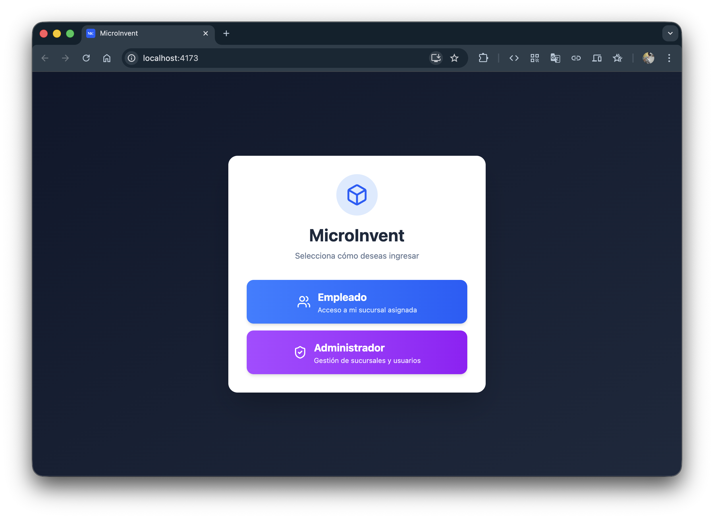

3. **Confirmar instalación:**
   - Aparecerá un cuadro de diálogo de confirmación
   - Haz clic en **"Instalar"**
   - La aplicación se abrirá automáticamente en una ventana independiente

4. **Acceso rápido:**
   - MicroInvent aparecerá como aplicación en:
     - Tu escritorio (si marcaste la opción)
     - El menú de aplicaciones de tu sistema operativo
     - La barra de tareas
     - Chrome → Apps (chrome://apps/)
   - Podrás iniciarla como cualquier aplicación de escritorio, sin necesidad de abrir el navegador

#### Cómo Instalar en Chrome (Android)

1. **Abrir en Chrome:**
   - Abre Google Chrome en tu dispositivo Android
   - Navega a la URL de la aplicación
   
2. **Instalar:**
   - Aparecerá un banner en la parte inferior: **"Agregar MicroInvent a la pantalla de inicio"**
   - Toca **"Instalar"** o **"Agregar"**
   
   Si no aparece el banner:
   - Toca el menú (⋮) → **"Agregar a pantalla de inicio"** o **"Instalar aplicación"**
   
   

3. **Usar la app:**
   - El icono de MicroInvent aparecerá en tu pantalla de inicio
   - Ábrela como cualquier otra aplicación
   - Funcionará incluso sin conexión a internet

#### Ventajas de Instalar la PWA

✅ **Funciona sin internet** - Accede a tus datos y realiza cambios incluso offline  
✅ **Experiencia nativa** - Se ejecuta en su propia ventana, sin barras del navegador  
✅ **Sincronización automática** - Los cambios offline se sincronizan cuando recuperas conexión  
✅ **Acceso rápido** - Lanza la app desde tu escritorio o pantalla de inicio en un clic  
✅ **Almacenamiento local** - Tus datos se guardan en el dispositivo para acceso instantáneo  
✅ **Actualizaciones automáticas** - La app se actualiza automáticamente cuando hay nuevas versiones

#### Desinstalar la PWA

**En Desktop:**

- Abre la aplicación
- Haz clic en el menú (⋮) → **"Desinstalar MicroInvent"**
- O desde Chrome: chrome://apps/ → clic derecho en MicroInvent → **"Eliminar de Chrome"**

**En Android:**

- Mantén presionado el icono de la app
- Selecciona **"Desinstalar"** o arrastra a la papelera

### Inicio de Sesión

El sistema cuenta con un flujo de autenticación de dos fases para administradores:

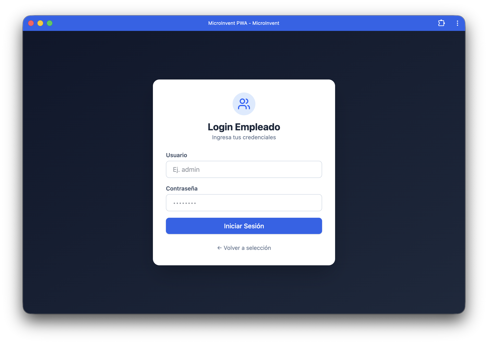

1. **Selección de Tipo de Usuario:**
   - Empleado: Acceso directo
   - Administrador: Requiere selección de sucursal

2. **Credenciales:**
   - Ingresa tu usuario y contraseña
   - Los empleados acceden directamente a su dashboard
   - Los administradores deben seleccionar su sucursal

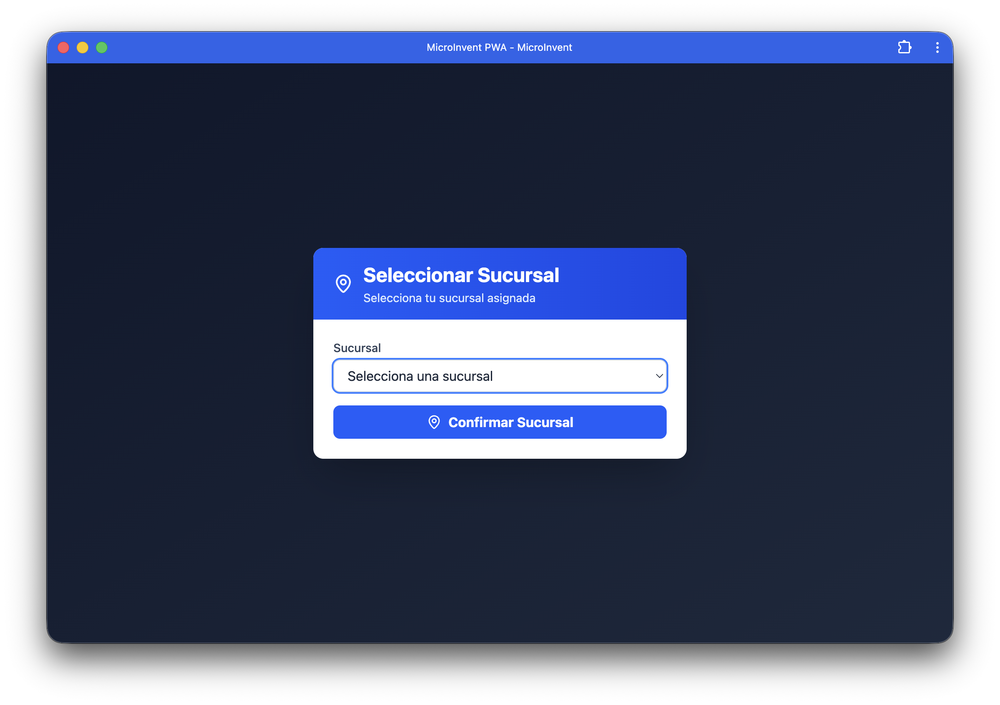

### Roles y Permisos

MicroInvent implementa un sistema de roles jerárquico con permisos específicos:

#### 🔴 SuperAdmin

- **Acceso:** Total y sin restricciones
- **Sucursal:** No asignado (puede cambiar entre todas las sucursales)
- **Permisos:**
  - ✅ Ver y gestionar todas las sucursales
  - ✅ Crear/editar/eliminar sucursales
  - ✅ Crear usuarios con cualquier rol (incluyendo otros SuperAdmins)
  - ✅ Ver y gestionar todos los usuarios del sistema
  - ✅ Acceso a módulo de Configuración completo
  - ✅ Resetear sistema completo
  - ✅ Ver inventario de cualquier sucursal
  - ✅ Generar reportes globales

#### 🟣 Admin

- **Acceso:** Administración de una sucursal específica
- **Sucursal:** Asignado a una sucursal fija
- **Permisos:**
  - ✅ Ver solo usuarios de su sucursal
  - ✅ Crear/editar/eliminar empleados de su sucursal
  - ❌ No puede crear otros admins
  - ❌ No puede cambiar de sucursal
  - ✅ Ver inventario de su sucursal
  - ✅ Gestionar productos de su sucursal
  - ✅ Ver reportes de su sucursal
  - ✅ Ver configuración (solo lectura)

#### 🔵 Employee (Empleado)

- **Acceso:** Operación básica de inventario
- **Sucursal:** Asignado a una sucursal fija
- **Permisos:**
  - ✅ Ver inventario de su sucursal
  - ✅ Registrar movimientos de inventario
  - ✅ Ver dashboard de su sucursal
  - ❌ No puede gestionar usuarios
  - ❌ No puede acceder a configuración
  - ❌ No puede cambiar de sucursal

### Funcionalidades por Rol

#### 📊 Dashboard

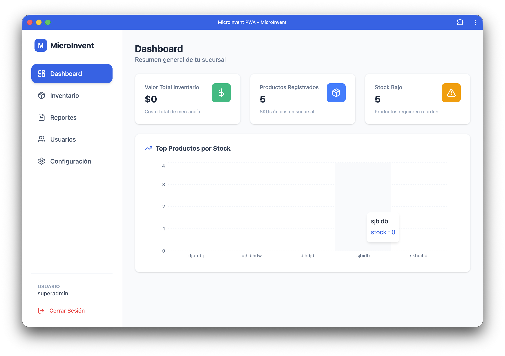

**Todos los roles:**

- Visualización de métricas clave:
  - Valor total del inventario
  - Productos registrados
  - Productos con stock bajo
- Gráfico de productos por stock
- Filtrado por sucursal (solo SuperAdmin)

**Vista SuperAdmin:**

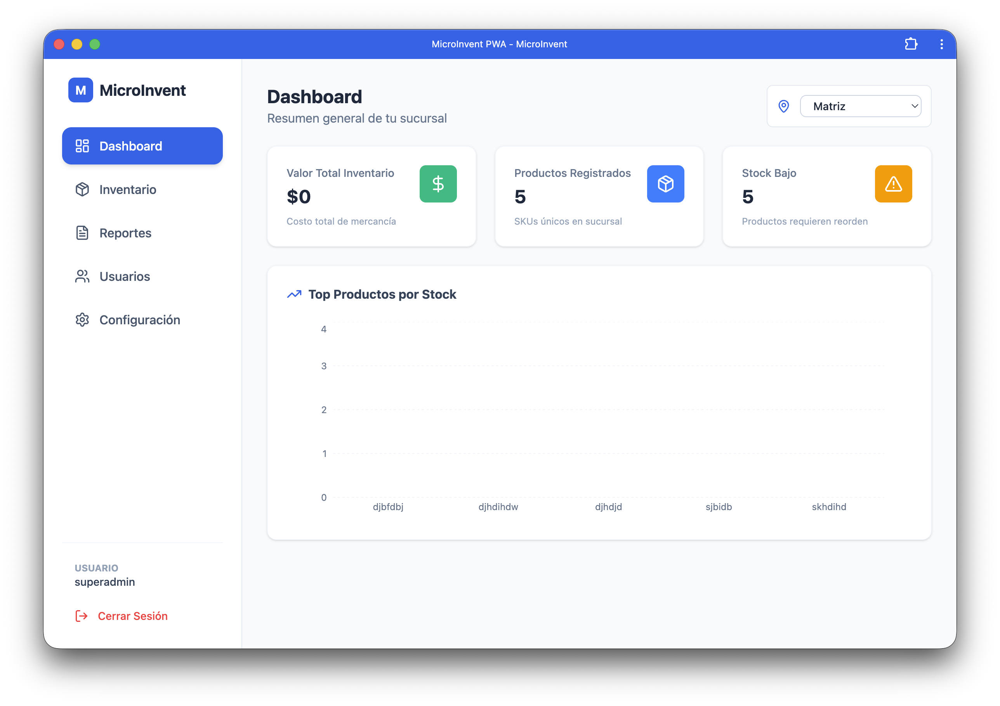

- Selector de sucursal en la parte superior
- Puede cambiar entre todas las sucursales para ver sus métricas

#### 📦 Inventario

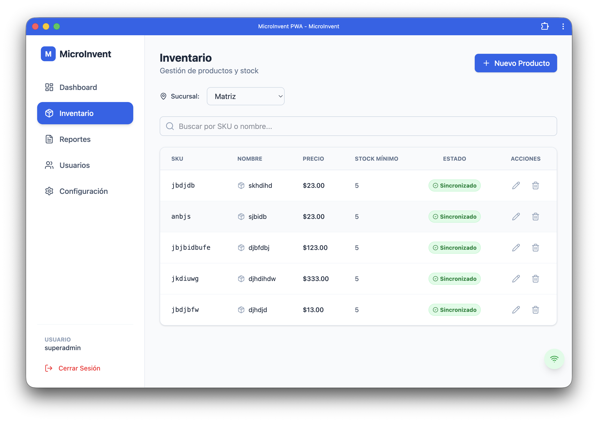

**SuperAdmin:**

- Selector de sucursal (puede ver cualquier sucursal)
- Agregar nuevos productos
- Editar productos existentes
- Eliminar productos
- Ver stock en tiempo real

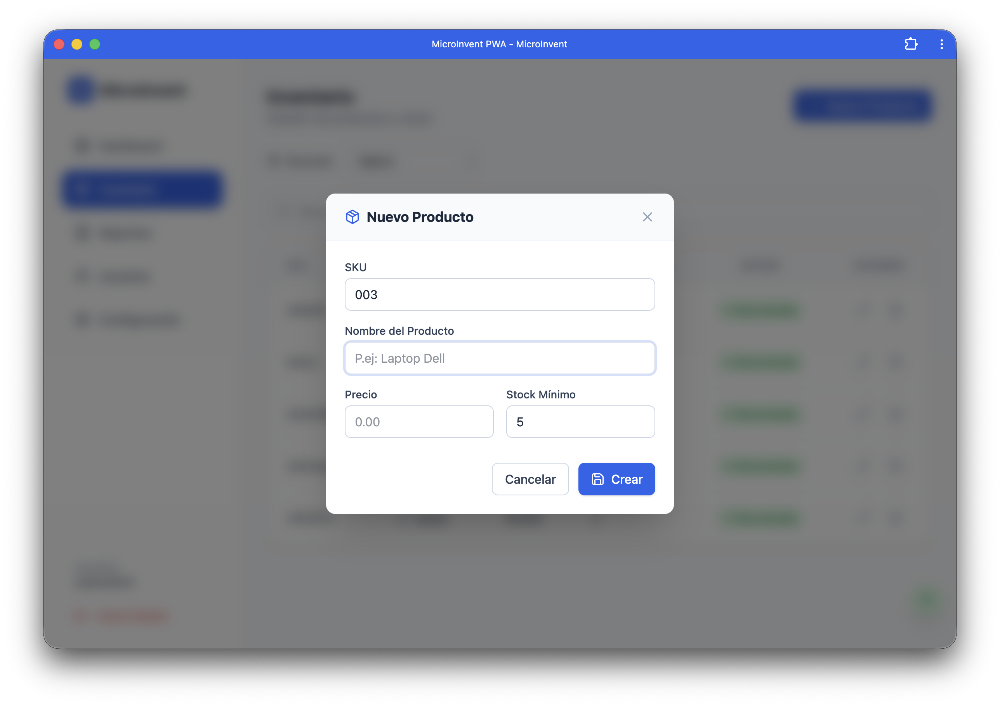

**Admin y Employee:**

- Vista fija de su sucursal
- Mismas funciones de gestión de productos

#### 👥 Usuarios (Solo Admin y SuperAdmin)

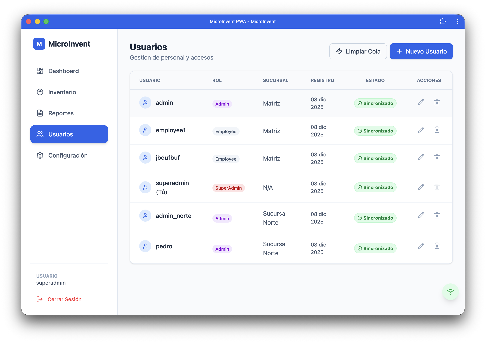

**SuperAdmin:**

- Ver todos los usuarios del sistema
- Crear usuarios con roles: Employee, Admin, SuperAdmin
- Asignar sucursales a usuarios
- Editar cualquier usuario
- Eliminar usuarios

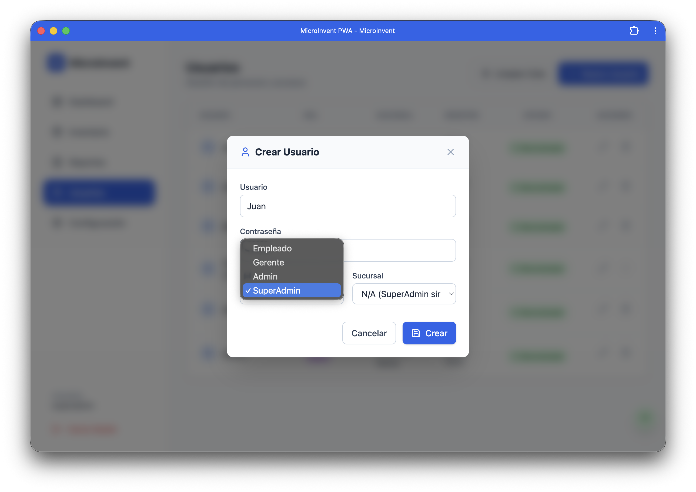

**Admin:**

- Ver solo empleados de su sucursal
- Crear solo empleados en su sucursal
- Editar solo empleados de su sucursal
- No puede cambiar roles ni sucursales

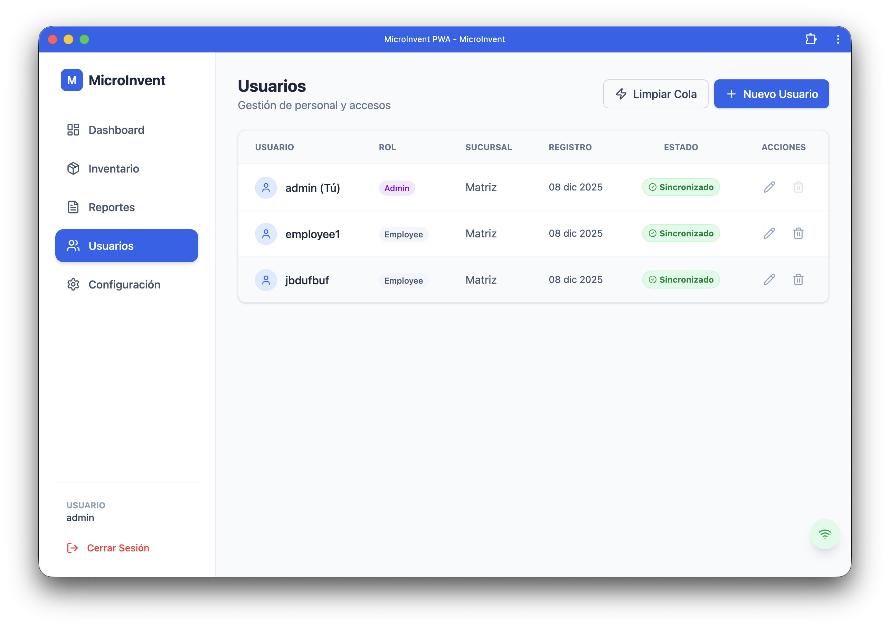

#### ⚙️ Configuración (Solo Admin y SuperAdmin)

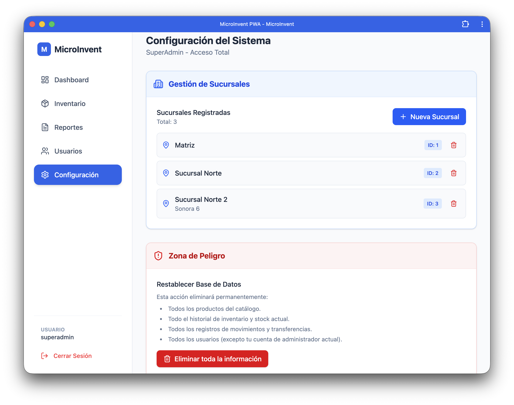

**SuperAdmin:**

- Ver lista de todas las sucursales
- Crear nuevas sucursales
- Eliminar sucursales individuales
- **Zona de Peligro:**
  - Resetear sistema completo (elimina todos los datos)
  - Confirmación requerida

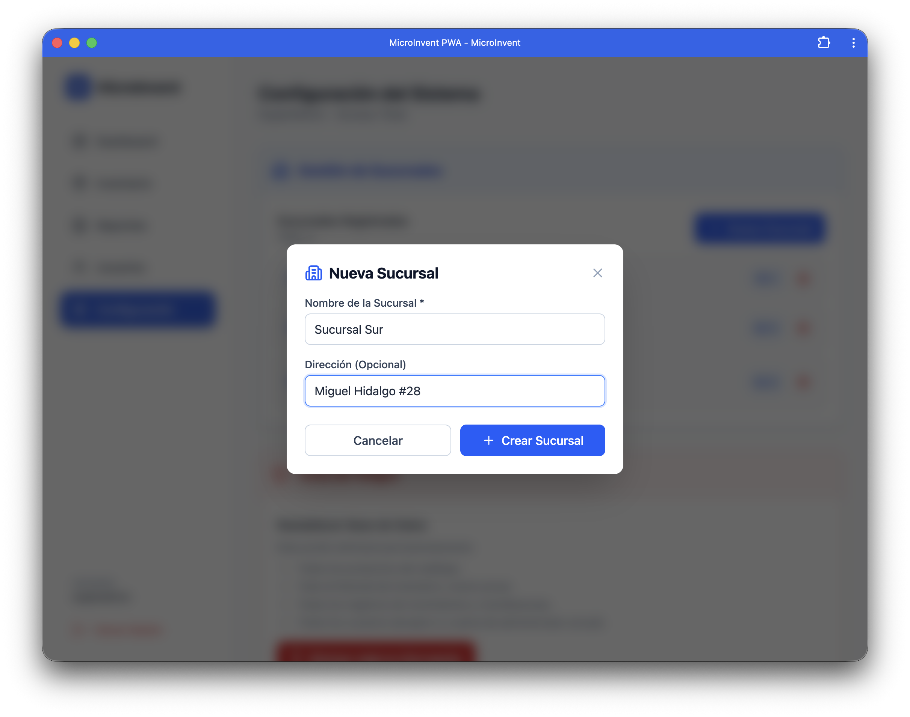

**Admin:**

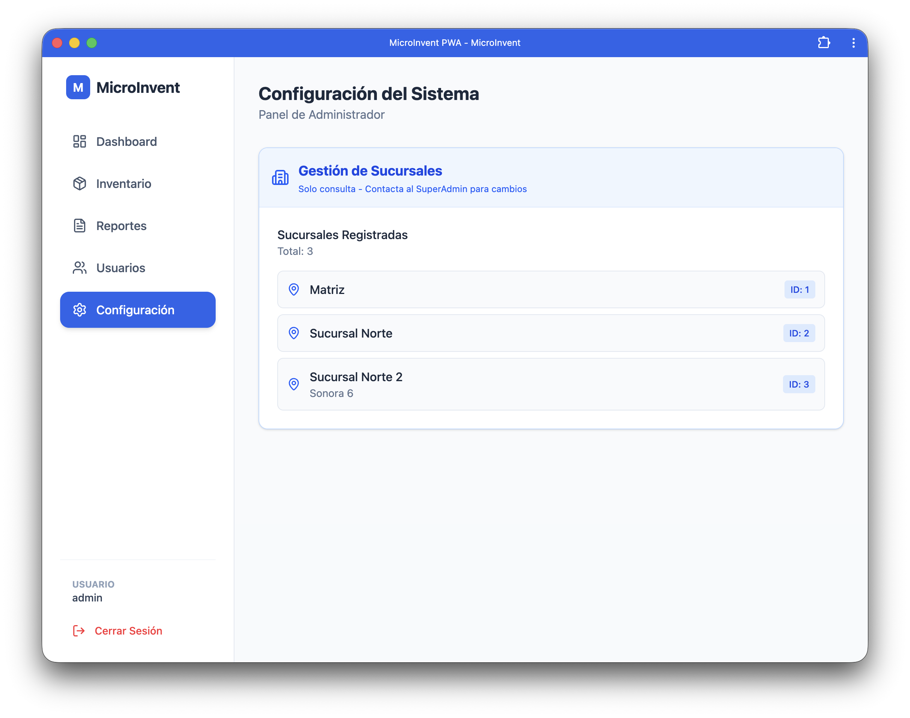

- Ver lista de sucursales (solo lectura)
- Mensaje: "Solo consulta - Contacta al SuperAdmin para cambios"

#### 📈 Reportes (Próximamente)

- Generación de reportes de movimientos
- Análisis de tendencias
- Exportación de datos

#### 🔄 Transferencias entre Sucursales (Próximamente)

**Desarrollado por: Angel**

- Solicitar transferencia de productos a otra sucursal
- Aprobar/rechazar solicitudes de transferencia
- Registrar envío de productos
- Confirmar recepción en sucursal destino
- Historial de transferencias

#### 📝 Registro de Entradas/Salidas (Próximamente)

**Desarrollado por: Angel**

- Registrar compras (entradas)
- Registrar ventas (salidas)
- Registrar mermas y ajustes
- Auditoría completa de movimientos
- Trazabilidad de cambios en inventario

### Modo Offline

MicroInvent funciona sin conexión a internet gracias a su arquitectura PWA:

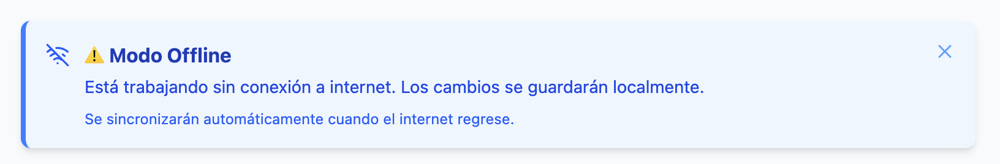

1. **Almacenamiento Local:** Los datos se guardan en IndexedDB
2. **Cola de Sincronización:** Las acciones offline se encolan
3. **Sincronización Automática:** Al recuperar conexión, los cambios se sincronizan automáticamente
4. **Indicadores Visuales:**
   - 🟢 Online: Sincronización en tiempo real
   - 🔴 Offline: Modo local, cambios en cola
   - 🟠 Pendiente: Acciones esperando sincronización

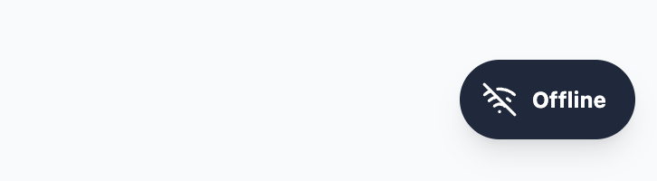

**Acciones soportadas en modo offline:**

- Crear, editar y eliminar productos
- Crear, editar y eliminar usuarios
- Visualizar inventario
- Ver dashboard y métricas

---


## 🗄 Arquitectura de Base de Datos

El esquema utiliza un diseño optimizado para transacciones concurrentes con integridad referencial.

### Tablas Principales

- `users` - Usuarios del sistema con roles y asignación a sucursales
  - Campos: id, username, password_hash, role, branch_id, created_at
  - Roles: superadmin, admin, employee

- `branches` - Sucursales del negocio
  - Campos: id, name, address, created_at

- `products` - Catálogo de productos por sucursal
  - Campos: id, sku, name, quantity, min_stock, price, branch_id, created_at

- `sessions` - Control de sesiones activas por usuario y sucursal
  - Campos: id, user_id, branch_id, created_at
  - Constraint: UNIQUE(user_id, branch_id)

### Relaciones

- **users.branch_id** → branches.id (Asignación de usuario a sucursal)
- **products.branch_id** → branches.id (Productos por sucursal)
- **sessions.user_id** → users.id (Sesiones de usuario)
- **sessions.branch_id** → branches.id (Sesión en sucursal específica)

---

## ☁️ Despliegue en AWS

El proyecto está diseñado para desplegarse en AWS usando servicios administrados:

### Arquitectura Planeada

- **Frontend:** AWS Amplify (Hosting estático con CDN)
- **Backend:** AWS Elastic Beanstalk (Auto-scaling + Load Balancer)
- **Base de Datos:** Amazon RDS PostgreSQL (Multi-AZ para alta disponibilidad)
- **Almacenamiento:** Amazon S3 (Reportes y archivos estáticos)

---

## 🔑 Credenciales de Prueba

Después de ejecutar los scripts de migración, el sistema incluye estos usuarios de prueba:

| Usuario | Contraseña | Rol | Sucursal |
|:---|:---|:---|:---|
| `superadmin` | `super123` | SuperAdmin | Sin asignar |
| `admin` | `admin123` | Admin | Matriz |
| `admin_norte` | `admin123` | Admin | Sucursal Norte |
| `employee1` | `user123` | Employee | Matriz |

**⚠️ Importante:** Cambiar estas contraseñas antes de producción.

---

## 📄 Licencia

MIT License - Ver archivo LICENSE para más detalles.

---

## 👨‍💻 Desarrolladores

- **Jorge Yorch** - Autenticación, Inventario, Gestión de Usuarios y Sucursales
- **Angel** - Reportes, Dashboard, Sincronización Offline

---

**Proyecto desarrollado para las materias de:**

- Desarrollo y Despliegue de Aplicaciones en La Nube
- Programación Web para Clientes y Usabilidad
- Desarrollo Backend con Frameworks Modernos
- Gestión de Proyectos de Software
